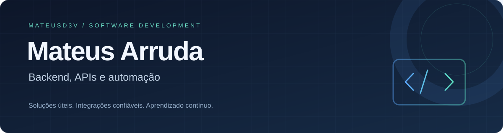

### Desenvolvimento de software · APIs · Automação

Estudante de Sistemas de Informação com experiência em desenvolvimento e suporte de TI.  
Transformo demandas do dia a dia em aplicações, integrações e melhorias para quem usa os sistemas.

---

## Sobre mim

Atuo no desenvolvimento e manutenção de sistemas na **SEGUP**, trabalhando com novas funcionalidades, APIs, dados e correção de bugs. Também tenho experiência em suporte remoto e presencial para **10 unidades do Colégio Physics / Rede Inspira**.

Essa vivência me ajuda a entender o problema do usuário, investigar sua causa e construir soluções com atenção à estabilidade e à qualidade.

- **Formação:** Sistemas de Informação, com conclusão prevista para o início de 2028.
- **Foco:** backend, integrações, automação e aplicações web.
- **Prática:** análise de logs, diagnóstico de problemas, testes e versionamento.
- **IA no desenvolvimento:** apoio à implementação, com revisão e validação dos resultados.

## Tecnologias

**Desenvolvimento**

**Dados e ferramentas**

## Projetos em destaque

| Projeto | O que desenvolvi | Tecnologias |
|:--|:--|:--|
| **[Job Application Agent](https://github.com/MateusD3v/vagas)** | Pipeline de coleta, deduplicação e análise de vagas, com preparação e acompanhamento de candidaturas. | Node.js · TypeScript · Fastify · PostgreSQL · Prisma · Docker |
| **[Sistema Financeiro](https://github.com/MateusD3v/sistema-financeiro)** | Painel de controle financeiro com organização mensal, metas, comparativo anual e autenticação. | JavaScript · Node.js · HTML · CSS · Supabase |
| **[Carteira Digital de Benefícios](https://github.com/MateusD3v/carteira-digital-beneficios)** | Projeto de PWA voltado à consulta de benefícios e ao uso em cenários de conectividade limitada. | Next.js · TypeScript · Tailwind CSS |
| **[Integração Python + APIs](https://github.com/MateusD3v/supabase-zapi-python)** | Integração entre banco de dados e API de mensagens, com validação e testes usando simulações. | Python · Supabase · Z-API |

## Experiência

**SEGUP — Estágio em Desenvolvimento de Software**  
Janeiro de 2026 — atual

Desenvolvimento e manutenção de aplicações, integração com APIs, manipulação de dados e investigação de bugs. Trabalho com Node.js, Java, Flutter, MySQL, Docker e Git.

**Rede Inspira / Colégio Physics — Estágio de Suporte TI**  
Junho de 2025 — atual

Atendimento remoto e presencial a 10 unidades, diagnóstico de computadores, suporte a redes e impressoras, configuração de sistemas e controle de ativos.

---

**Construindo soluções úteis e evoluindo com cada projeto.**

[Explore meus repositórios →](https://github.com/MateusD3v?tab=repositories)

